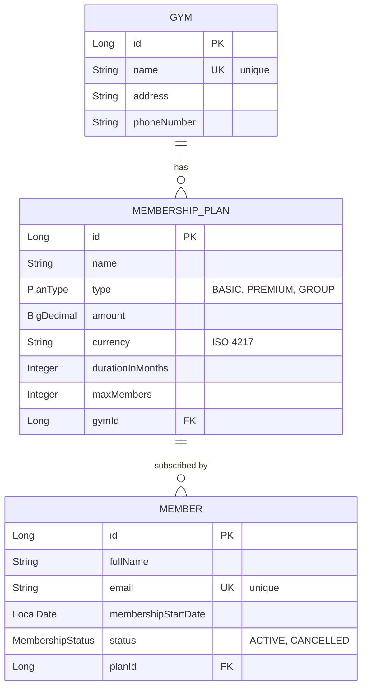

# Gym Membership Management System

A REST API for managing gym memberships, built with Spring Boot. Allows creating gyms, defining membership plans, registering members, and managing subscription statuses with automatic capacity enforcement.

## Tech Stack

- **Java 21** (LTS)
- **Spring Boot 3.5.14**
    - Spring Web (REST)
    - Spring Data JPA (persistence)
    - Spring Validation (Bean Validation)
- **H2 Database** (in-memory, for development)
- **Maven** (build tool)
- **Lombok** (boilerplate reduction)

## Quick Start

### Prerequisites
- Java 21 (Eclipse Temurin recommended)
- Maven 3.9+

### Run the application

```bash
git clone https://github.com/SzymonWoroniecki/gym-membership-system.git
cd gym-membership-system
mvn spring-boot:run
```

The application will start on `http://localhost:8080`.

### H2 Console

H2 in-memory database console is available at `http://localhost:8080/h2-console`.

- **JDBC URL:** `jdbc:h2:mem:gymdb`
- **Username:** `sa`
- **Password:** _(empty)_

## API Endpoints

### Gyms

#### Create gym
`POST /gyms`

Request body:
```json
{
  "name": "FitLife Center",
  "address": "ul. Marszałkowska 1, Warszawa",
  "phoneNumber": "+48123456789"
}
```
Response: `201 Created` with the created gym.

#### List all gyms
`GET /gyms`

Response: `200 OK` with array of gyms.

---

### Membership Plans

#### Create plan for a gym
`POST /gyms/{gymId}/plans`

Request body:
```json
{
  "name": "Premium Annual",
  "type": "PREMIUM",
  "amount": 999.00,
  "currency": "PLN",
  "durationInMonths": 12,
  "maxMembers": 50
}
```

`type` accepts: `BASIC`, `PREMIUM`, `GROUP`.
`currency` must be a valid ISO 4217 code (e.g., `PLN`, `EUR`, `USD`).

Response: `201 Created` with the created plan.

#### List plans for a gym
`GET /gyms/{gymId}/plans`

Response: `200 OK` with array of plans for the specified gym.

---

### Members

#### Register member to a plan
`POST /plans/{planId}/members`

Request body:
```json
{
  "fullName": "Jan Kowalski",
  "email": "jan@example.com"
}
```

Response: `201 Created` with the created member (includes plan and gym info).

**Capacity enforcement:** If the plan has reached its `maxMembers` limit (counting only `ACTIVE` members), the request is rejected with `409 Conflict`.

#### List all members
`GET /members`

Response: `200 OK` with array of all members (both active and cancelled).

#### Cancel membership
`POST /members/{memberId}/cancel`

Changes member status from `ACTIVE` to `CANCELLED`. Cancelled members do not count toward 
plan capacity.

Response: `200 OK` with the updated member.

---

## Error Handling

The API returns structured JSON error responses with appropriate HTTP status codes:

| Status | When |
|--------|------|
| `400 Bad Request` | Invalid input (validation failures, malformed currency codes) |
| `404 Not Found` | Resource does not exist (gym, plan, or member with given ID) |
| `409 Conflict` | Business rule violation (duplicate gym name, duplicate email, plan capacity reached, member already cancelled) |

Example error response:
```json
{
  "timestamp": "2026-05-05T14:30:00",
  "status": 409,
  "message": "Plan capacity reached: 50 of 50 members"
}
```

Validation errors include field-level details:
```json
{
  "timestamp": "2026-05-05T14:30:00",
  "status": 400,
  "error": "Validation failed",
  "fieldErrors": {
    "email": "Invalid email format",
    "fullName": "Full name is required"
  }
}
```

## Domain Model

### Entity Relationships



### Business Rules

- A **gym** must have a unique name (case-insensitive).
- A **plan** belongs to exactly one gym (`@ManyToOne`).
- A **member** subscribes to exactly one plan and inherits the gym through that plan.
- A new member always starts with `ACTIVE` status.
- A plan cannot accept new members if the count of `ACTIVE` members reaches `maxMembers`.
- Cancelled members do not count toward plan capacity, freeing up space for new registrations.
- Email addresses must be unique across all members.

## Architecture

The project follows a standard **layered architecture** with clear separation of concerns:

```
Controller (REST API)
        ↓
Service (business logic)
        ↓
Repository (data access)
        ↓
Database (H2)
```

### Package Structure

```
io.github.SzymonWoroniecki.gym_membership_system/
├── controller/      # REST endpoints (@RestController)
├── service/         # Business logic (@Service, @Transactional)
├── repository/      # Spring Data JPA repositories
├── entity/          # JPA entities (@Entity)
├── dto/             # Data Transfer Objects (Java records)
├── enums/           # PlanType, MembershipStatus
├── exception/       # Custom exceptions + @RestControllerAdvice
└── config/          # Configuration (e.g., CurrencyConverter)
```

### Layer Responsibilities

- **Controller** — receives HTTP requests, validates input (`@Valid`), delegates to service, returns proper HTTP status codes.
- **Service** — contains business logic (capacity check, member status updates), manages transactions (`@Transactional`), maps between DTOs and entities.
- **Repository** — Spring Data JPA interfaces with derived query methods (e.g., `countByPlanIdAndStatus` for capacity check).
- **DTO** — separates API contract from database model (using Java 21 records for immutability).

## Key Design Decisions

This section documents the most important technical and architectural choices made during the project, including the alternatives considered and the reasoning behind each decision.

### 1. Money as `@Embeddable` (Value Object pattern)

**Decision:** Plan price stored as a single `Money` field combining `BigDecimal amount` and `java.util.Currency`.

**Considered alternatives:**
- Two flat fields on the entity (`BigDecimal amount` + `String currency`)
- A separate `Money` entity with its own table

**Why this approach:**
- The Value Object pattern keeps amount and currency together
- `@Embeddable` keeps everything in the parent table — same database schema, cleaner Java model.
- Using `java.util.Currency` (instead of `String`) provides automatic ISO 4217 validation: `Currency.getInstance("XYZ")` throws `IllegalArgumentException`.
- A custom `AttributeConverter` (`CurrencyConverter`) handles the mapping between `Currency` object and `VARCHAR(3)` column.

### 2. `BigDecimal` for monetary amounts

**Decision:** Use `BigDecimal` with `precision=12, scale=2`.

**Considered alternatives:**
- `double` or `float` (rejected — floating-point arithmetic causes rounding errors with money)
- `Long` representing cents (rejected — less expressive, requires conversion in API)

**Why this approach:**
- `BigDecimal` is recommended for monetary values to avoid floating-point rounding errors.
- `scale=2` matches typical currency precision.
- `precision=12` allows amounts up to ~10 billion, sufficient for any realistic gym membership pricing.

### 3. Cancellation as restrictive (not idempotent)

**Decision:** Attempting to cancel an already-cancelled member returns `409 Conflict`.

**Considered alternatives:**
- Idempotent cancel (always return `200 OK` regardless of current state)

**Why this approach:**
- This makes potential issues in the client more visible, instead of silently doing nothing.
- Provides clearer feedback to API consumers about state.
- The client needs to either check status before cancelling or handle `409` responses.

### 4. Plan name uniqueness

**Decision:** Plan names are **not** required to be unique (neither globally nor per gym).

**Considered alternatives:**
- Globally unique plan names
- Composite unique constraint `(gym_id, name)`

**Why this approach:**
- The specification does not require uniqueness.
- Different gyms naturally have plans with similar names ("Basic", "Premium").
- Even within a gym, duplicate names may be valid business cases (e.g., promotional vs. regular plans with the same display name).
- The current scope does not require this constraint, so it is intentionally omitted.

### 5. Unidirectional relationships

**Decision:** Only `@ManyToOne` is used. No `@OneToMany` on the parent side (Gym has no `List<Plan>` field, Plan has no `List<Member>` field).

**Considered alternatives:**
- Bidirectional relationships with cascade operations

**Why this approach:**
- Avoids infinite recursion when serializing to JSON (Gym → Plan → Gym → ...).
- Simpler entity model.
- For lists, dedicated repository methods are used (e.g., `findByGymId`).

### 6. DTO pattern with Java records

**Decision:** Separate `Request` and `Response` DTOs as Java 21 records, distinct from JPA entities.

**Considered alternatives:**
- Returning entities directly from controllers
- Single DTO class for both request and response

**Why this approach:**
- The API stays independent of the database model — schema changes don't break the API.
- Records are a concise way to define immutable data classes; they automatically provide getters, `equals`, `hashCode`, and `toString`.
- Validation annotations on request DTOs (`@NotBlank`, `@Email`, `@Pattern`) keep entities clean.
- Response DTOs can flatten relationships (e.g., `planName` and `gymName` instead of nested objects).

### 7. Custom exceptions with global handler

**Decision:** Domain-specific exceptions (`GymNotFoundException`, `PlanCapacityReachedException`, etc.) handled by a single `@RestControllerAdvice`.

**Considered alternatives:**
- `ResponseStatusException` thrown directly in services
- Generic exceptions with status codes inferred from messages

**Why this approach:**
- Each business rule has its own exception type, making the code easier to read.
- HTTP status codes (404, 409, 400) are mapped in one place.
- All endpoints return errors in the same format.
- Validation errors (`MethodArgumentNotValidException`) are also handled, providing field-level error details.

### 8. Capacity check via repository count

**Decision:** Use `memberRepository.countByPlanIdAndStatus(planId, ACTIVE)` instead of loading all members.

**Considered alternatives:**
- Loading all members for the plan and counting in memory
- Maintaining a counter field on the plan entity

**Why this approach:**
- Database returns a single integer — minimal data transfer.
- Spring Data generates the SQL automatically (`SELECT COUNT(*) ... WHERE plan_id = ? AND status = ?`).
- No risk of the counter getting out of sync — the database is always the source of the actual count.
- Cancellation automatically frees capacity